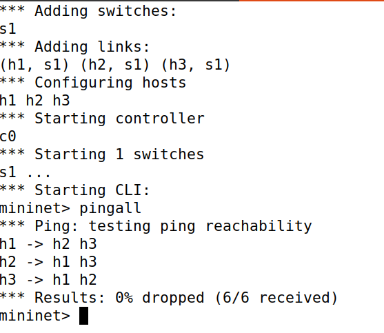
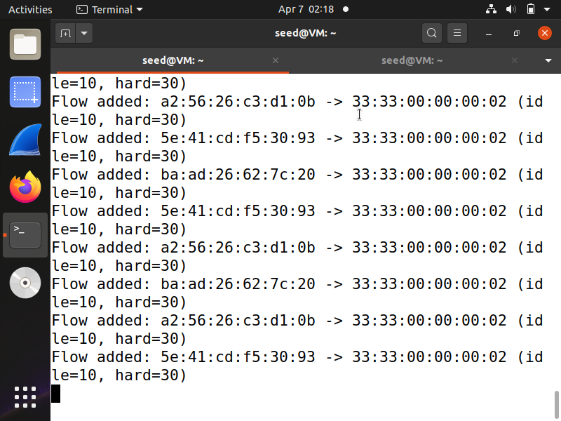
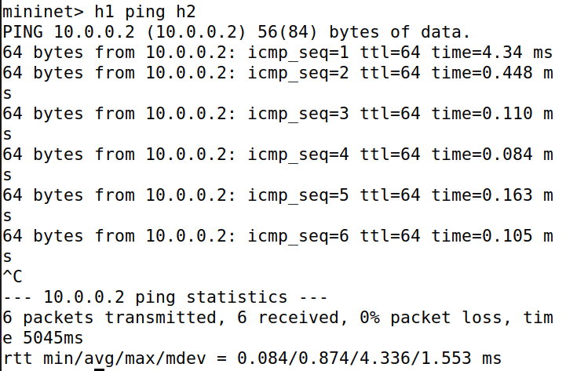
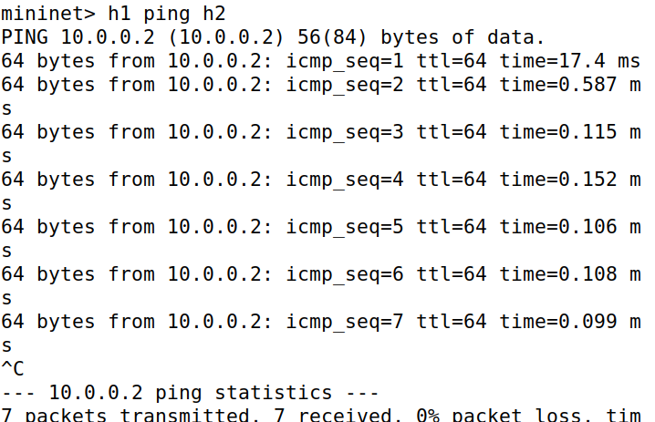

# SDN Flow Rule Timeout Manager using Ryu Controller

## 1. Project Overview

This project implements a Software Defined Networking (SDN) solution using Mininet and a Ryu controller. The focus is on managing flow rules using timeout mechanisms.

The controller dynamically installs flow entries with:

* Idle timeout (removes inactive flows)
* Hard timeout (removes flows after fixed time)

This ensures efficient network operation and prevents stale entries in the flow table.

---

## 2. Objectives

* Implement controller–switch interaction using OpenFlow
* Design and install flow rules using match–action logic
* Demonstrate timeout-based flow rule management
* Analyze network behavior using latency observations

---

## 3. Technologies Used

* Python (Ryu Controller)
* Mininet
* OpenFlow 1.3
* Linux (Ubuntu)

---

## 4. Network Topology

* 1 Switch (s1)
* 3 Hosts (h1, h2, h3)
* Remote controller (Ryu)

---

## 5. Setup and Execution

### Step 1: Run Ryu Controller

```bash
ryu-manager timeout_controller.py
```

### Step 2: Start Mininet

```bash
sudo mn --topo single,3 --controller remote --switch ovsk,protocols=OpenFlow13
```

### Step 3: Test Connectivity

```bash
pingall
```

---

## 6. Controller Logic

The controller performs the following operations:

* Handles `packet_in` events from switches
* Learns MAC-to-port mappings
* Installs flow rules with timeout values:

  * idle_timeout = 10 seconds
  * hard_timeout = 30 seconds
* Uses PacketOut to forward the first packet
* Logs flow installation events

---

## 7. Results and Observations

### 7.1 Connectivity Test



All hosts successfully communicate with 0% packet loss.

---

### 7.2 Flow Rule Installation



Flow entries are installed dynamically with timeout values.

---

### 7.3 Initial Packet Delay



The first packet experiences higher latency due to controller processing.
Subsequent packets are forwarded directly by the switch, resulting in lower latency.

---

### 7.4 Timeout Behavior



After waiting beyond the idle timeout:

* Flow entries expire
* The next packet again goes to the controller
* Latency increases temporarily

---

## 8. Performance Analysis

| Scenario           | Observation                |
| ------------------ | -------------------------- |
| First Packet       | Higher latency (~10–20 ms) |
| Subsequent Packets | Low latency (~0.1–0.5 ms)  |
| After Timeout      | Latency increases again    |

---

## 9. Validation

* Connectivity verified using `pingall`
* Latency observed using `ping`
* Flow lifecycle verified through repeated tests
* Timeout behavior confirmed

---

## 10. Project Structure

```
SDN-Flow-Timeout-Manager/
│── timeout_controller.py
│── screenshots/
│   ├── pingall.png
│   ├── flow_logs.png
│   ├── first_ping.png
│   └── timeout_ping.png
│── README.md
```

---

## 11. Conclusion

This project demonstrates effective flow rule management in SDN using timeout mechanisms. It shows how controllers dynamically handle traffic and maintain efficient flow tables.

---

## 12. Author

- Name: Sharvanee Naru  
- SRN: PES2UG24CS459
  
---
